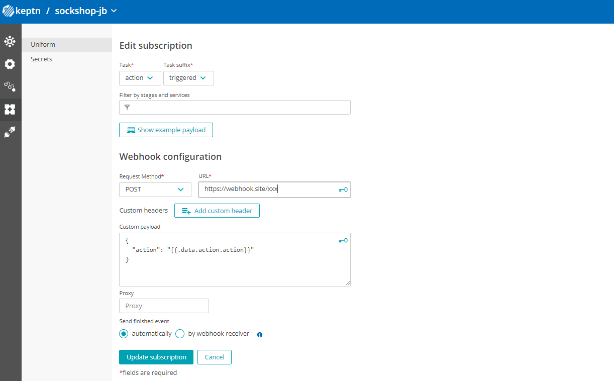

# Hands-on training about Automated Remediation with Keptn

This is a hands-on training to explore the capabilities of automated remediations with Keptn. 

## Prerequisites

* Download **Keptn CLI** from [here](https://github.com/keptn/keptn/releases/tag/0.11.3) and install it on your machine.
  * Run `keptn version` to verify CLI version to be: `Keptn CLI version: 0.11.3`

## Training

* *Your instructor*, Johannes, will provide you access to a Keptn instance. Download the `keptn auth` command from the Keptn Bridge and execute the command locally: 

    ```
    keptn auth --endpoint=http://keptn-instance/api --api-token=xxxx
    ```

* Create a project using the provided `shipyard.yaml`. :mag: Take a look at the remediation sequence to understand the remedation process.

    ```
    keptn create project sockshop-[YOUR-FIRST-NAME] --shipyard=shipyard.yaml
    ```

* Create `carts` service: 

    ```
    keptn create service carts --project=sockshop-[YOUR-FIRST-NAME]
    ```

* Upload the `remediation.yaml` file to the service. :mag: Take a look at the *problem title* <> *action* mapping.

    ```
    keptn add-resource --project=sockshop-[YOUR-FIRST-NAME] --stage=production --service=carts --resource=./remediation.yaml --resourceUri=remediation.yaml
    ```

* Configure a webhook subscription: 
  * Go to `https://webhook.site` to create a webhook which will be called. Copy to clipboard.
  * Go to **Keptn** > **your project** > **Uniform**
  * Select **webhook-service** and **Add Subscription**
  * Fill out the form as shown here 
    * Paste the webhook URL in the field `URL`
    * The custom payload is: 
    ```
    {
      "action": "{{.data.action.action}}"
    }
    ```

    

* Simulate a problem by triggering the remediation sequence directly. Therefore, open the `trigger_remediaton.yaml` file and change [YOUR-FIRST-NAME] to your first name. Then trigger the remediation using the following command: 

    ```
    keptn send event -f trigger_remedation.yaml
    ```